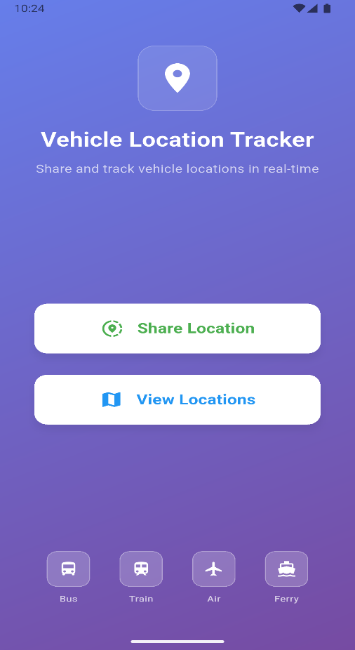
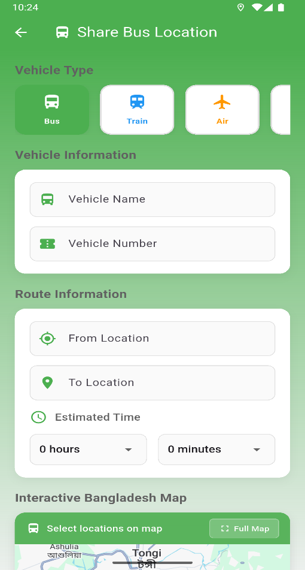
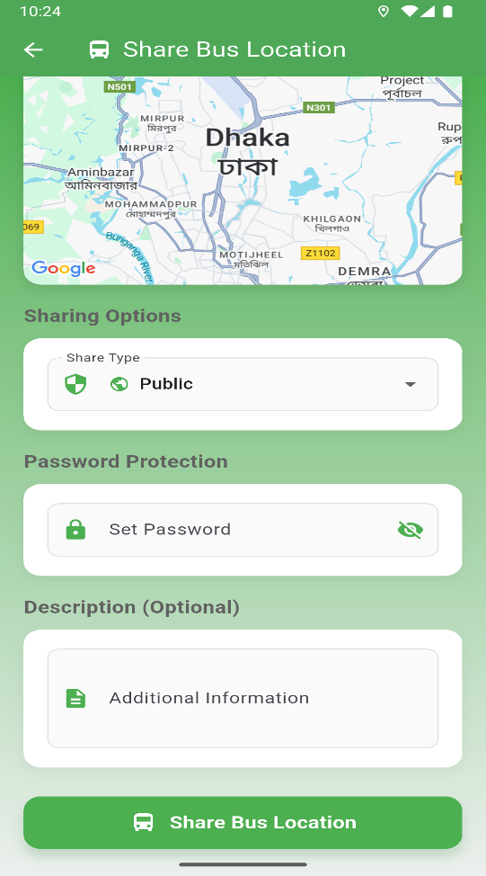
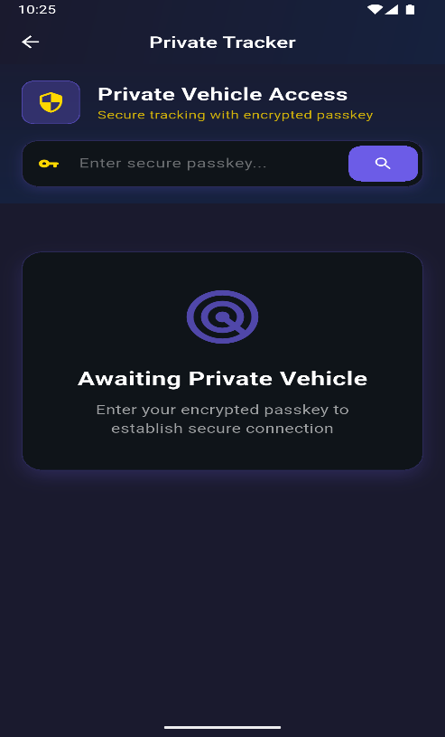
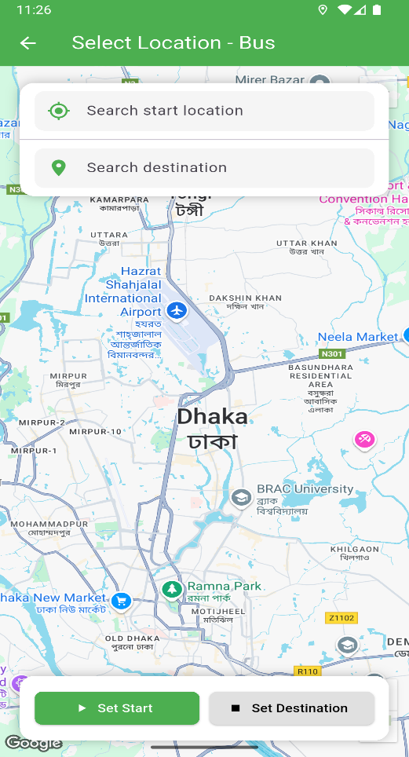
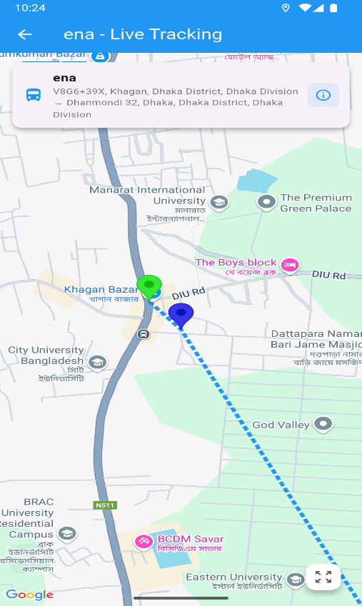
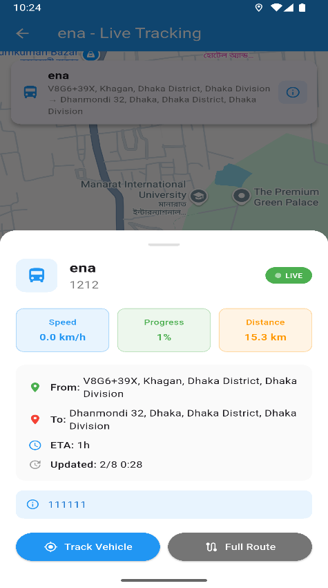

<h1 align="center">🚗 TrackMate</h1>

  <b>Smart Location Sharing & Tracking App built with Flutter</b>  
   
   
  <a href="https://github.com/ji-jony/TrackMate-Flutter/stargazers">⭐ Star this repo</a> •
  <a href="#-demo">🎬 Demo</a> •
  <a href="#-installation">⚙️ Installation</a> •
  <a href="#-screenshots">🖼️ Screenshots</a> •
  <a href="#-license">🪪 License</a>

---

## 🌍 Overview

**TrackMate** is a Flutter-based smart location-sharing and tracking application that helps users share and follow real-time locations — even without direct GPS access.  
It’s designed for simplicity, privacy, and smooth performance. Perfect for tracking vehicles, family, or friends.  

---

## ✨ Features

- 📍 **Live Location Sharing** — Share your movement in real time  
- 🛰️ **Track Others Securely** — Private tracking with permission control  
- 🔐 **Privacy First** — Data is shared only with trusted users  
- 🧭 **Offline Tracking Support** — Works even without GPS  
- 🎨 **Beautiful UI** — Clean, modern Flutter interface  
- ⚙️ **Easy Setup** — Just install and start tracking  

---

## 🖼️ Screenshots

|  |  |  |  |  |  |  |  |

